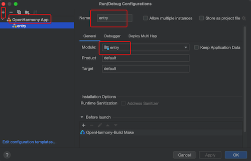
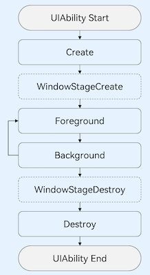

## HarmonyOS学习概要

### 鸿蒙介绍

- 官方资料
    - [华为开发者联盟](https://developer.huawei.com/consumer/cn/)
    - [HarmonyOS 开发文档](https://developer.huawei.com/consumer/cn/doc/harmonyos-guides-V2/start-overview-0000001478061421-V2)
    - [华为开发者论坛](https://developer.huawei.com/consumer/cn/forum/)


- OpenHarmony与HarmonyOS联系与区别
    - [OpenHarmony与HarmonyOS联系与区别](https://blog.csdn.net/gongjdde/article/details/131854200)
    - [OpenAtom OpenHarmony](https://www.openharmony.cn/mainPlay/)


### 项目结构介绍

- 开发环境搭建
    - [开发环境 DevEco Studio IDE 安装及运行Hello World](https://developer.huawei.com/consumer/cn/training/course/slightMooc/C101667303102887820)
    - [HUAWEI DevEco Studio和SDK下载](https://developer.harmonyos.com/cn/develop/deveco-studio#download)

  
- [快捷键及编辑器配置](https://developer.huawei.com/consumer/cn/doc/harmonyos-guides-V2/editer_overview-0000001053502418-V2)
    - 代码自动跳转：在编辑器中，可以按住 **Command/Ctrl 键**，鼠标单击代码中引用的类、方法、参数、变量等名称，自动跳转到定义处。
    - 跨语言跳转，在编辑器中右击，在弹出的菜单中选择**Go To > Implementation(s)**实现跨语言跳转。
    - 代码格式化，快捷键**Option+Command +L**（window为 Ctrl + Alt + L） 可以快速对选定范围的代码进行格式化。
    - 代码折叠/展开：
        - 选重代码： **Command -  / +**
        - 递归折叠： **Command alt - / +**
    - 代码快速注释:  **Command+/ （window Ctrl+/）**进行快速注释
    - 代码结构树: 使用快捷键 Alt + 7 / Ctrl + F12（macOS为**Command+7**）打开代码结构树，快速查看文件代码的结构树，包括全局变量和函数，类成员变量和方法等，并可以跳转到对应代码行。
    - 代码引用查找: 单击鼠标右键 > Find Usages或使用快捷键 Alt +F7（macOS为**Command + F7**），帮助开发者快速查看某个对象(变量、函数或者类等)被引用的地方，用于后续的代码重构，可以极大的提升开发者的开发效率。
    - 代码查找: 通过连续点击**两次Shift快捷键**，打开代码查找界面，通过对符号、类或文件的即时导航来查找代码。
    - 快速查阅API接口及组件参考文档：可在编辑器中，鼠标悬停在需要查阅的接口或组件，弹窗显示当前接口，单击弹窗右下角**Show in API Reference**，可以快速查阅更全面的API文档。


- 运行已有项目

    - 打开项目后
    - 点击运行，选择 Edit Configrations
    - 点击 + 选择 OpenHarmony App
    - Name 输入：entry, Moduls 选择 entry

  


#### 项目文件说明

- AppScope中存放应用全局所需要的资源文件
    - resources
        - element：文件夹主要存放公共的字符串、布局文件等资源。
        - media：存放全局公共的多媒体资源文件。
    - app.json5

- [entry是应用的主模块，存放HarmonyOS应用的代码、资源等](https://developer.huawei.com/consumer/cn/training/course/slightMooc/C101667303102887820)
    - src
        - main：ets文件夹用于存放ets代码，resources文件存放模块内的多媒体及布局文件等，module.json5文件为模块的配置文件
        - main/ets/entryability: 存放ability文件，用于当前ability应用逻辑和生命周期管理
        - main/ets/pages: 存放UI界面相关代码文件，初始会生成一个Index页面
        - main/module.json5: 模块的配置文件，包含当前模块的配置信息
        - main/resources: 目录下存放模块公共的多媒体、字符串及布局文件等资源
        - main/resources/base/profile/main_pages.json: 文件保存的是页面page的路径配置信息，所有需要进行路由跳转的page页面都要在这里进行配置
        - ohosTest：单元测试目录ohosTest，以及模块级的配置文件
    - build-profile.json5：模块级配置信息，包括编译构建配置项
    - hvigorfile.ts 文件是模块级构建脚本
    - oh-package.json5：模块级依赖配置信息文件

- oh_modules：工程的依赖包，存放工程依赖的源文件。

- build-profile.json5：工程级配置信息，包括签名、产品配置等。

- hvigorfile.ts：工程级编译构建任务脚本，hvigor是基于任务管理机制实现的一款全新的自动化构建工具，主要提供任务注册编排，工程模型管理、配置管理等核心能力。

- oh-package.json5：工程级依赖配置文件，用于记录引入包的配置信息。


### ArkTS、TypeScript 语法

- ArkTS是HarmonyOS优选的主力应用开发语言。ArkTS围绕应用开发在TypeScript（简称TS）生态基础上做了进一步扩展，继承了TS的所有特性，是TS的超集。
- 参考资料
    - [初识ArkTS语言-学习ArkTS语言](https://developer.harmonyos.com/cn/docs/documentation/doc-guides-V3/arkts-get-started-0000001504769321-V3)
    - [状态管理概述-状态管理](https://developer.harmonyos.com/cn/docs/documentation/doc-guides-V3/arkts-state-management-overview-0000001524537145-V3)
    - [鸿蒙HarmonyOS实战-ArkTS语言-基本语法](https://www.wpeu.cn/post/6586.html)
    - [鸿蒙HarmonyOS实战-ArkTS语言基础类库（并发）](https://juejin.cn/post/7325781954769960995)


- TypeScript
    - **TypeScript 是带有编译时类型检查器的 JavaScript 运行时** 。
    - [TypeScript 教程(runoob.com)](https://www.runoob.com/typescript/ts-tutorial.html)
    - [ArkTS开发语言介绍](https://developer.huawei.com/consumer/cn/training/course/slightMooc/C101667356568959645)
    - [TypeScript: 学习](https://www.typescriptlang.org/zh/docs/)
    - [TypeScript 中文网: 手册](https://ts.nodejs.cn/docs/handbook/intro.html)
    - [TypeScript 使用指南手册](https://www.patrickzhong.com/TypeScript/PREFACE.html)
    - [TypeScript 语言教程](https://wangdoc.com/typescript/intro)


### 资源获取

- 颜色值配置：/entry/src/main/resources/base/element/color.json

  ```typescript
  {
    "color": [
      {
        "name": "title_text_color",
        "value": "#182431"
      }
    ]
  }
  
  // 资源获取
  $r('app.color.title_text_color')
  ```

- 视图尺寸：/entry/src/main/resources/base/element/float.json

  ```typescript
  {
    "float": [
      {
        "name": "logo_image_size",
        "value": "78vp"
      }
    ]
  }
  
  // 资源获取
  $r('app.float.logo_image_size')
  ```

- 语言资源定义,base、 en_US、zh_CN  下的 string.json 都要添加，否则会报错

  ```typescript
  {
    "string": [
      {
        "name": "setting_list_storage",
        "value": "清除缓存"
      }
    ]
  }
  
  // 资源获取
  $r('app.string.setting_list_storage')
  ```

- 图片获取：e/entry/src/main/resources/base/media 目录下，获取$r('app.media.storage')

- 资源的获取：$r('app.资源文件名称.资源值')

- 单位说明

    - vp：virtual pixel以屏幕相对像素为单位, 是一台设备针对应用而言所具有的虚拟尺寸（区别于屏幕硬件本身的像素单位）。它提供了一种灵活的方式来适应不同屏幕密度的显示效果,使用虚拟像素，使元素在不同密度的设备上具有一致的视觉体量。
    - fp： font pixel 字体像素(font pixel) 大小默认情况下与 vp 相同，即默认情况下 1 fp = 1vp。如果用户在设置中选择了更大的字体，字体的实际显示大小就会在 vp 的基础上乘以 scale 系数，即 1 fp = 1 vp * scale。
    - px：pixel 屏幕上的实际像素, 1px代表手机屏幕上的一个像素点, 如果这个不怎么好理解,看下常见的手机比如:1080×1920 这个数值的单位都是px,由于px在不同手机上的大小不同，差别较大，适配性太差，不建议使用,所以无论是android 还是HarmonyOS 无论写距离大小换是字体大小,都不建议使用px。


- 注意事项：

    - 资源描述符不能拼接使用，如color() 获取；仅支持普通字符串如'app.type.name'。$r返回值为Resource对象，可通过getStringValue 方法获取对应的字符串。

      ```typescript
        public static color(): Resource {
          return $r(`app.color.green`)
        }
      ```


- [更多资源分类与访问介绍](https://developer.huawei.com/consumer/cn/doc/harmonyos-guides-V2/resource-categories-and-access-0000001711674888-V2)


### APP及页面的生命周期

#### UIAbility组件生命周期(单组件时等于APP 生命周期)

- UIAbility概述

    - UIAbility是一种包含用户界面的应用组件，主要用于和用户进行交互。UIAbility也是系统调度的单元，为应用提供窗口在其中绘制界面。
    - 每一个UIAbility实例，都对应于一个最近任务列表中的任务。
    - 一个应用可以有一个UIAbility，也可以有多个UIAbility。
    - 一个UIAbility可以对应于多个页面，建议将一个独立的功能模块放到一个UIAbility中，以多页面的形式呈现。浏览内容的时候，可以进行多页  面的跳转使用。
    - 在src/main/ets/entryability目录下，初始会生成一个UIAbility文件**EntryAbility.ts**。可以在EntryAbility.ts文件中根据业务需要实现UIAbility的生命周期回调内容。


- UIAbility的生命周期

    - UIAbility的生命周期包括Create、Foreground、Background、Destroy四个状态，
    - WindowStageCreate和WindowStageDestroy为窗口管理器（WindowStage）在UIAbility中管理UI界面功能的两个生命周期回调，从而实现UIAbility与窗口之间的弱耦合。
    - 在 onWindowStageCreate 添加启动页面入口

  ```typescript
    onWindowStageCreate(windowStage: window.WindowStage) {
      windowStage.loadContent('Pages/MainPage', (err, data) => {
      });
    }
  ```





- UIAbility的启动模式
    - singleton（单实例模式）启动模式为单实例模式，也是默认情况下的启动模式。
    - multiton（多实例模式）启动模式为多实例模式，每次调用startAbility()方法时，都会在应用进程中创建一个新的该类型UIAbility实例。
    - specified（指定实例模式）启动模式为指定实例模式，针对一些特殊场景使用（例如文档应用中每次新建文档希望都能新建一个文档实例，重复打开一个已保存的文档希望打开的都是同一个文档实例）。
- 参考文档：
    - [Stage模型开发指导-应用模型](https://developer.huawei.com/consumer/cn/doc/harmonyos-guides-V2/uiability-lifecycle-0000001427902208-V2)
    - [应用程序框架](https://developer.huawei.com/consumer/cn/training/course/slightMooc/C101667310940295021)


####  [自定义组件生命周期](https://developer.huawei.com/consumer/cn/doc/harmonyos-guides-V2/arkts-page-custom-components-lifecycle-0000001524296665-V2)

- 自定义组件：@Component装饰的UI单元，可以组合多个系统组件实现UI的复用。
- 页面：即应用的UI页面。可以由一个或者多个自定义组件组成，@Entry装饰的自定义组件为页面的入口组件，即页面的根节点，一个页面有且仅能有一个@Entry。只有被@Entry装饰的组件才可以调用页面的生命周期。

- 页面生命周期：
    - onPageShow：页面每次显示时触发。
    - onPageHide：页面每次隐藏时触发一次。
    - onBackPress：当用户点击返回按钮时触发。
    - aboutToAppear：组件即将出现时回调该接口，具体时机为在创建自定义组件的新实例后，在执行其build()函数之前执行。
    - aboutToDisappear：在自定义组件即将析构销毁时执行。

```typescript
@Entry
@Component
struct FwXXXPage {
  aboutToAppear() {
    Log.debug("about Appear")
  }

  aboutToDisappear() {
    Log.debug("about Disappear")
  }

  onPageShow(){
    Log.debug("on Page Show")
  }

  onPageHide() {
    Log.debug("on Page Hide")
  }

  onBackPress() {
    Log.debug("on Back Press")
  }

  build() {
    //...
  }
}
```


#### [PageAbility生命周期](https://developer.huawei.com/consumer/cn/doc/harmonyos-guides-V2/pageability-overview-0000001478340893-V2)

- PageAbility是包含UI界面、提供展示UI能力的应用组件，主要用于与用户交互。
- 延伸阅读参考上面链接


### [组件、容器、列表](https://developer.huawei.com/consumer/cn/training/course/slightMooc/C101667360160710997)

#### 页面布局

##### Flex

- 弹性布局

    - Flex组件在渲染时存在二次布局过程，因此在对性能有严格要求的场景下建议使用[Column](https://developer.harmonyos.com/cn/docs/documentation/doc-references-V3/ts-container-column-0000001478341157-V3)、[Row](https://developer.harmonyos.com/cn/docs/documentation/doc-references-V3/ts-container-row-0000001478061717-V3)代替。

    - Flex组件主轴默认不设置时撑满父容器，[Column](https://developer.harmonyos.com/cn/docs/documentation/doc-references-V3/ts-container-column-0000001478341157-V3)、[Row](https://developer.harmonyos.com/cn/docs/documentation/doc-references-V3/ts-container-row-0000001478061717-V3)组件主轴不设置时默认是跟随子节点大小。
    - 弹性布局在开发场景中用例特别多，比如页面头部导航栏的均匀分布、页面框架的搭建、多行数据的排列等等。

- 介绍资料

    - [弹性布局(Flex)](https://developer.harmonyos.com/cn/docs/documentation/doc-guides-V3/arkts-layout-development-flex-layout-0000001504525013-V3)
    - [Flex-容器组件](https://developer.harmonyos.com/cn/docs/documentation/doc-references-V3/ts-container-flex-0000001427902472-V3?catalogVersion=V3)


##### Stack 层叠布局

- 层叠布局（StackLayout）用于在屏幕上预留一块区域来显示组件中的元素，提供元素可以重叠的布局。
- 参考资料：
    - [层叠布局（Stack）-构建布局](https://developer.harmonyos.com/cn/docs/documentation/doc-guides-V3/arkts-layout-development-stack-layout-0000001454605342-V3)


##### Column

- Column容器内子元素按照垂直方向排列。

- 参考资料

    - [线性布局Row/Column](https://developer.harmonyos.com/cn/docs/documentation/doc-guides-V3/arkts-layout-development-linear-0000001504125349-V3)
    - [Column-容器组件](https://developer.harmonyos.com/cn/docs/documentation/doc-references-V3/ts-container-column-0000001478341157-V3)


##### Row

- Row容器内子元素按照水平方向排列。

- 参考资料
    - [线性布局Row/Column](https://developer.harmonyos.com/cn/docs/documentation/doc-guides-V3/arkts-layout-development-linear-0000001504125349-V3)
    - [Row-容器组件](https://developer.harmonyos.com/cn/docs/documentation/doc-references-V3/ts-container-row-0000001478061717-V3)


#### [应用组件](https://developer.harmonyos.com/cn/docs/documentation/doc-references-V3/ts-container-alphabet-indexer-0000001427744828-V3)

##### Text

- 显示一段文本的组件。
- 参考资料
    - [Text-基础组件-组件参考](https://developer.harmonyos.com/cn/docs/documentation/doc-references-V3/ts-basic-components-text-0000001477981201-V3)


##### TextArea

- 多行文本输入框组件，当输入的文本内容超过组件宽度时会自动换行显示。
- 高度未设置时，组件无默认高度，自适应内容高度。宽度未设置时，默认撑满最大宽度。
- 问题：**文本过长时,无法滚动**
- 参考资料
    - [TextArea-基础组件](https://developer.harmonyos.com/cn/docs/documentation/doc-references-V3/ts-basic-components-textarea-0000001427902464-V3)


##### Image

- Image为图片组件，常用于在应用中显示图片。
- 参考资料
    - [Image-基础组件](https://developer.harmonyos.com/cn/docs/documentation/doc-references-V3/ts-basic-components-image-0000001428061728-V3)


##### TextInput

- 单行文本输入框组件。
- 参考资料
    - [TextInput-基础组件](https://developer.harmonyos.com/cn/docs/documentation/doc-references-V3/ts-basic-components-textinput-0000001427584864-V3)


##### Button

- 按钮组件，可快速创建不同样式的按钮。
- 参考资料
    - [Button-基础组件](https://developer.harmonyos.com/cn/docs/documentation/doc-references-V3/ts-basic-components-button-0000001427584848-V3)


##### LoadingProgress

- 用于显示加载动效的组件。
- 参考资料
    - [LoadingProgress-基础组件](https://developer.harmonyos.com/cn/docs/documentation/doc-references-V3/ts-basic-components-loadingprogress-0000001427744812-V3)


##### List列表

- 列表包含一系列相同宽度的列表项。适合连续、多行呈现同类数据，例如图片和文本。
- 参考资料
    - [List-容器组件-组件参考](https://developer.harmonyos.com/cn/docs/documentation/doc-references-V3/ts-container-list-0000001477981213-V3)


##### Grid列表

- 网格容器，由“行”和“列”分割的单元格所组成，通过指定“项目”所在的单元格做出各种各样的布局。
- 参考资料
    - [Grid-容器组件-组件参考](https://developer.harmonyos.com/cn/docs/documentation/doc-references-V3/ts-container-grid-0000001478341161-V3)


##### Swiper

- 滑块视图容器，提供子组件滑动轮播显示的能力。
- 参考资料
    - [Swiper-容器组件-组件参考](https://developer.harmonyos.com/cn/docs/documentation/doc-references-V3/ts-container-swiper-0000001427744844-V3)


##### [打印日志-Logger](https://developer.huawei.com/consumer/cn/doc/harmonyos-guides-V2/ide-debug-hilog-0000001172459337-V2)


##### [页面数据传递](https://developer.huawei.com/consumer/cn/training/course/slightMooc/C101680765314766141)


##### Navigation

- Navigation组件一般作为Page页面的根容器，通过属性设置来展示页面的标题栏、工具栏、导航栏等。
- 参考资料
    - [快速实现页面导航之Navigation ](https://www.cnblogs.com/mayism123/p/17853395.html)
    - [Navigation-组件导航-设置页面路由和组件导航](https://developer.harmonyos.com/cn/docs/documentation/doc-guides-V3/arkts-navigation-navigation-0000001453365116-V3)
    - [Navigation-基础组件-组件参考](https://developer.harmonyos.com/cn/docs/documentation/doc-references-V3/ts-basic-components-navigation-0000001478341133-V3)
    - [ArkTs如何自定义容器组件](https://developer.harmonyos.com/cn/docs/documentation/doc-guides-V3/arkts-builderparam-0000001524416541-V3#section95615504245)


### [保存应用数据](https://developer.huawei.com/consumer/cn/training/course/slightMooc/C101667367018821971)

- 用户首选项为应用提供Key-Value键值型的数据处理能力，支持应用持久化轻量级数据，并对其修改和查询。

- Key键为string类型，要求非空且长度不超过80个字节。

- 如果Value值为string类型，可以为空，不为空时长度不超过8192个字节。

- 内存会随着存储数据量的增大而增大，所以存储的数据量应该是轻量级的，建议存储的数据不超过一万条，否则会在内存方面产生较大的开销。

- 参考资料

    - [通过用户首选项实现数据持久化-应用数据持久化](https://developer.huawei.com/consumer/cn/doc/harmonyos-guides-V2/data-persistence-by-preferences-0000001505432513-V2)


- [重新运行Studio，持久化的数据就没有](https://developer.huawei.com/consumer/cn/forum/topic/0208135362613074134?fid=0102683795438680754)

    - 点击ide有下角有个Run按钮，再点扳手🔧那个图标，弹出框有个“Keep Application Data”打勾就可以了。


- ?[应用数据持久化概述-应用数据持久化](https://developer.huawei.com/consumer/cn/doc/harmonyos-guides-V2/app-data-persistence-overview-0000001505513497-V2)

- ?[通过关系型数据库实现数据持久化](https://developer.huawei.com/consumer/cn/doc/harmonyos-guides-V2/data-persistence-by-rdb-store-0000001505752421-V2)


### 闪屏启动页

- 参考资料

    - [HarmonyOS应用开发-闪屏启动页_鸿蒙os 闪屏页-CSDN博客](https://blog.csdn.net/liuhaikang/article/details/134903019)

    - [Codelabs: 分享知识与见解，一起探索HarmonyOS的独特魅力。 - Gitee.com](https://gitee.com/harmonyos/codelabs/tree/master/OxHornCampus)


### [网络获取数据](https://developer.huawei.com/consumer/cn/training/course/slightMooc/C101667364948559963) ->
- Web组件
  - Web组件来加载网页，借助它我们就相当于在自己的应用程序里嵌入一个浏览器，从而非常轻松地展示各种各样的网页。
  - 存在问题：[webview 加载的 h5 页面，点击没有反应](https://developer.huawei.com/consumer/cn/forum/topic/0204134856168916017)


- JSON转换

  ```typescript
  export default class Fruit {
      fruitName: string = '';
      fruitNum: string = '';
  }
  private fruit: Fruit = new Fruit();
  
  // 对象转字符串
  JSON.stringify(fruit)
  
  // 字符串转对象
  JSON.parse(fruit)
  ```


### [给应用添加通知和提醒](https://developer.huawei.com/consumer/cn/training/course/slightMooc/C101689244351517164)


### [ArkUI之属性动画 动画](https://developer.huawei.com/consumer/cn/training/course/slightMooc/C101667368091091005)


### [应用/服务上架](https://developer.huawei.com/consumer/cn/training/course/slightMooc/C101689684184109157)


### 源码学习

- [一起探索HarmonyOS的独特魅力](https://gitee.com/harmonyos/codelabs)
- [《跟老卫学HarmonyOS开发》](https://github.com/waylau/harmonyos-tutorial)
- [HarmonyOS阅读笔记](https://www.cnblogs.com/mayism123/p/?page=1)
- [HarmonyOS实战](https://www.wpeu.cn/search.php?q=HarmonyOS)


### 注意事项

- $r加载资源文件，要指定名称，如： $r('app.media.right_grey')，应该是在编译时将资源替换了，而动态名称只有在运行时才确定

- media 下的图片资源不支持子文件夹

- 不进行语法校验  ```// @ts-nocheck ```


### 约束与限制
- 本示例仅支持标准系统上运行，支持设备：华为手机或运行在DevEco Studio上的华为手机设备模拟器。
- 本示例为Stage模型，支持API version 9。
- 本示例需要使用DevEco Studio 3.1 Release版本进行编译运行。
