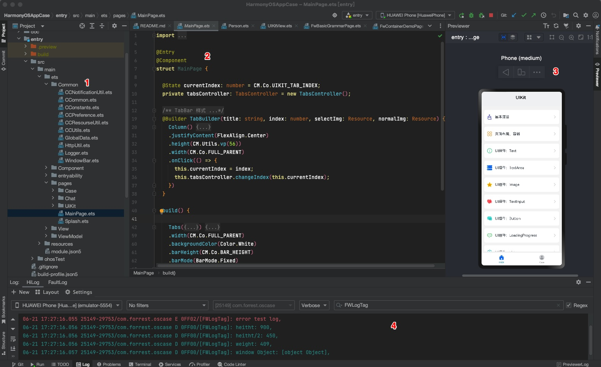

## HarmonyOS应用案例

- 本项目是鸿蒙HarmonyOS APP开发的示例，方便快速找到相关特性，提高开发速度。
- 首先了解下项目运行后的效果：

### 项目说明：

- 在DevEco-Studio IDE，打开项目的效果如下图：

- 序号1：文件导航目录，包含哪些文件及目录结构。
- 序号2：为ArtTS代码及页面结构。
- 序号3：为page页面的预览效果。
- 序号4：打印日志的查看。
- 项目目录说明：
  - Common：封装了常用组件、工具，如日志打印、工具类、常量类、持久化类、数据内保类等
  - UiKit：包含了常用组件的使用示例
  - Case：包含了各种特性：如聊天功能、下载页面、店铺列表、任务列表等。

